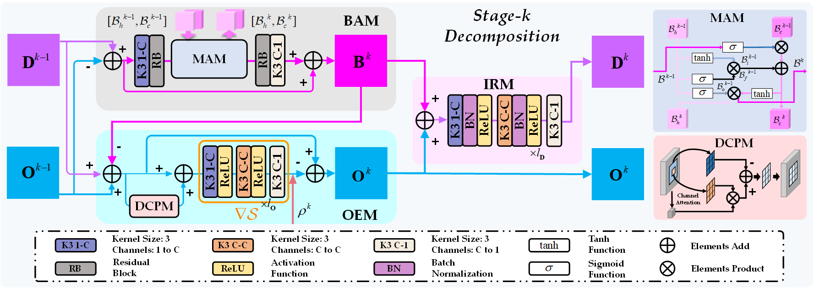
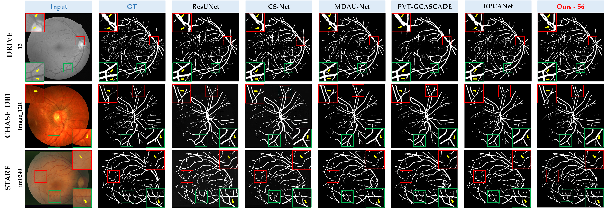

# RPCANet++ and RPCANet

This repository is the implementation of RPCANet and RPCANet++ 

[2025] **RPCANet++**: Deep Interpretable Robust PCA for Sparse Object Segmentation.

[](http://arxiv.org/abs/2508.04190) [](https://github.com/fengyiwu98/RPCANet) [](https://fengyiwu98.github.io/rpcanetx/) 
> **Authors:** Fengyi Wu, Yimian Dai,Tianfang Zhang, Yixuan Ding, Jian Yang, Ming-Ming Cheng, and Zhenming Peng. 

[2024] **RPCANet**: Deep Unfolding RPCA Based Infrared Small Target Detection.

 [](https://openaccess.thecvf.com/content/WACV2024/html/Wu_RPCANet_Deep_Unfolding_RPCA_Based_Infrared_Small_Target_Detection_WACV_2024_paper.html) [](https://github.com/fengyiwu98/RPCANet)
> **Authors:** Fengyi Wu#, Tianfang Zhang#, Lei Li, Yian Huang, and Zhenming Peng.


- [Overview](#overview)
    - [Overall Pipeline](#-overall-pipeline)
    - [Comparison of RPCANet++ and RPCANet](#-comparison-of-rpcanet++-and-rpcanet)
- [Get It Started](#get-it-started)
    - [Requirements](#requirements)
    - [Datasets](#datasets)
    - [Training](#training)
    - [Testing](#testing)
    - [Interpretable Model Verification Toolkit: dulrs](#interpretable-model-verification-toolkit)
- [Results and Training Weights](#-results-and-training-weights)


## Overview
Robust principal component analysis (RPCA) decomposes an observation matrix into low-rank background and sparse object components. This capability has enabled its application in tasks ranging from image restoration to segmentation. However, traditional RPCA models suffer from computational burdens caused by matrix operations, reliance on finely tuned hyperparameters, and rigid priors that limit adaptability in dynamic scenarios. To solve these limitations, we propose RPCANet series (RPCANet and RPCANet++), sparse object segmentation frameworks that fuse the interpretability of RPCA with efficient deep architectures.

In this repo, we provide:

**1. Instructions and Codes** on training and testing for **RPCANet** and **RPCANet++** for sparse object segmentation.

**2. Interpretable Model Verification Toolkit**: 
- lowrankness and sparsity metrics;
- easy-to-use visualization tools.
### Overall Pipeline


### Comparison of RPCANet++ and RPCANet
**RPCANet++** excced **RPCANet** from following aspects:
1. **Methododology**:  
- To **solve the background transmission loss**, we introduce a memory-augmented module in the **BAM** to enhance the feature restoration. 
- Besides, inspired by prior assistants in mainstream optimization methods, we design a **saliency-inspired prior** **DCPM** to accurate the object extraction and accelerate convergence process. 
- A more **detailed deduction** of Lipschitz continuity on **OEM**.

2. **Experiments**: 
- **Six more datasets** are added: Despite adding one more dataset on infrared small target detection, we extend the application to the **sparse object segmentation domain** with typical application on vessel and defect images. 
- We provide a more **profound analysis** of RPCANets with novel metrics like the measurement of **low rankness and sparsity**, increase the **post hoc interpretability** of our module.

<details>
<summary>Detail Structure of RPCANet++ and RPCANet</summary>
<div align="center">

**RPCANet++**



**RPCANet**


</div>

</details>


## Get It Started
### Requirements
- **Python 3.8**
- **Windows10, Ubuntu18.04 or higher**
- **NVDIA GeForce RTX 3090**
- **pytorch 1.8.0 or higher**
- **More details from requirements.txt** 

**A Quick Example**

```
conda create -n rpcanets python=3.8
conda activate rpcanets
pip install torch==1.8.0+cu111 torchvision==0.9.0+cu111 -f https://download.pytorch.org/whl/torch_stable.html
pip install -r requirements.txt
```

### Datasets
We evaluate our methods on **nine** different datasets across **three** domains:

-  **Infrared Small Target Detection (IRSTD)**: [NUDT-SIRST](https://github.com/YeRen123455/Infrared-Small-Target-Detection), [IRSTD-1K](https://github.com/RuiZhang97/ISNet), [SIRST](https://github.com/YimianDai/sirst), [SIRST-Aug](https://github.com/Tianfang-Zhang/AGPCNet).

-  **Vessel Segmentation (VS)**: [DRIVE](https://ieeexplore.ieee.org/document/1282003), [STARE](https://cecas.clemson.edu/~ahoover/stare/), [CHASE_DB1](https://researchdata.kingston.ac.uk/96/).

-   **Defect Detection (DD)**: [NEU-Seg](https://github.com/DHW-Master/NEU_Seg), [SD-saliency-900](https://github.com/SongGuorong/MCITF/tree/master/SD-saliency-900).


 
**Please first download these datasets and place the datasets to the folder `./datasets/`.** 


* **Our project has the following structure:**
```
├──./datasets/
│    ├── Dataset_name
│    │    ├── train
│    │    │    ├── images
│    │    │    │    ├── 000001.png
│    │    │    │    ├── ...
│    │    │    ├── masks
│    │    │    │    ├── 000001.png
│    │    │    │    ├── ...
│    │    ├── test
│    │    │    ├── images
│    │    │    │    ├── 000002.png
│    │    │    │    ├── ...
│    │    │    ├── masks
│    │    │    │    ├── 000002.png
│    │    │    │    ├── ...
```
<br>

### Training
* **Run** `run.py` **to perform network training:**
```bash
$ python run.py
```

### Testing
* **Run** `t_models_istd.py` `t_models_vs.py` `t_models_dd.py` **to generate file of the format .mat and .png:**
```bash
$ python t_models_istd.py
$ python t_models_vs.py
$ python t_models_dd.py
```
Note: The training and inference methods are slightly different, where we refer to [Link](https://github.com/XinyiYing/BasicIRSTD).
* **The file generated will be saved to** `./pngResults/` **that has the following structure**:
```
├──./pngResults/
│    ├── [dataset_name]
│    │    ├── [model_name]
│    │    │   ├── img
│    │    │   │    ├── 000000.png
│    │    │   │    ├── ...
│    │    │   ├── mat
│    │    │   │    ├── 000000.mat
│    │    │   │    ├── ...
```
* **Run** `cal_metric_istd.py`, `cal_metric_vs.py`, and `cal_metric_dd.py`**for direct evaluation**:
```bash
$ python cal_metric_istd.py
```
```bash
$ python cal_metric_vs.py
```
```bash
$ python cal_metric_dd.py
```
Here, we refer to [Link](https://github.com/lseventeen/FR-UNet/blob/master/utils/metrics.py) and [Link](https://github.com/mczhuge/SOCToolbox/blob/main/codes/metrics.py) for VS task and DD task evaluation.

### Interpretable Model Verification Toolkit
The `dulrs` package provides tools to calculate and visualize some evaluation matrix (heatmap, low-rankness, sparsity)of our models on various scenarios from different datasets.

**1. Installation**

First, install the package using `pip`:

```bash
pip install dulrs
```

**2. Importing the Package**

Import the package in your Python script:


```python
from dulrs import dulrs_class
```
**3. Available Functions**

The package includes the following functions:

0. `dulrs_class(model_name, model_path, num_stages=6, use_cuda=True)`
1. `dulrs_class.heatmap(img_path, data_name,output_mat,output_png)`
2. `dulrs_class.lowrank_cal(img_path, model_name, data_name, save_dir)`
3. `dulrs_class.lowrank_draw(model_name, data_name, mat_dir, save_dir)`
4. `dulrs_class.sparsity_cal(img_path, model_name, data_name, save_dir)`

Please refer to `dulrs_example.py` or `README.md` in the package for more details.

**4. Visualzation Results**

<div align="center">

**Heatmaps**


**Lowrankness Measurements**


**Sparsity Measurements**


</div>


## Results and Training Weights

### Visualization Results

<div align="center">

#### ISTD Task

#### VS Task

#### DD Task

</div>


### Numerical Results

#### ISTD Task
| Model              |NUDT-SIRST |  |  |      |                      IRSTD-1K                      |                                                    |       |      |                       SIRST                        |                                                    |       |  |                     SIRST-Aug                      |                                                    |  |  | Params | FLOPs |         Weight          |
|--------------------|----------|------------|-------|:----:|:--------------------------------------------------:|:--------------------------------------------------:|:-----:|:----:|:--------------------------------------------------:|:--------------------------------------------------:|:-----:|:---:|:--------------------------------------------------:|:--------------------------------------------------:|:---:|:---:|:---:|:---:|:-----------------------:|
|                    |IoU | F1 | Pd |  Fa  |                        IoU                         |                         F1                         |  Pd   |  Fa  |                        IoU                         |                         F1                         |  Pd   | Fa|                        IoU                         |                         F1                         | Pd | Fa| | ||
| RPCANet            |89.31 | 94.35 | 97.14 | 2.87 |                       63.21                        |                       77.45                        | 88.31 | 4.39 |                       70.37                        |                       82.61                        | 95.41 | 7.42 |                       72.54                        |                       84.08                        | 98.21 | 34.14 | 0.680 | -/0.0217 | [weight](./result/ISTD) |
| **RPCANet++ - S3** |92.70<sub><font color="#C71585">+3.39</font></sub> | 96.21<sub><font color="#C71585">+1.86</font></sub> | 98.31 | 1.67 | 64.40<sub><font color="#C71585">+1.19</font></sub> | 78.34<sub><font color="#C71585">+0.98</font></sub> | 92.78 | 5.56 | 75.52<sub><font color="#C71585">+5.15</font></sub> | 86.06<sub><font color="#C71585">+3.45</font></sub> | 100.0 | 8.70| 73.90<sub><font color="#C71585">+1.36</font></sub> | 85.01<sub><font color="#C71585">+0.93</font></sub> | *98.90* | 28.64 | 1.435 | -/0.0262 |[weight](./result/ISTD) |
| **RPCANet++ - S6**      | 94.39<sub><font color="#C71585">+5.08</font></sub> | 97.12<sub><font color="#C71585">+2.77</font></sub> | 98.41 | 1.34 | 64.93<sub><font color="#C71585">+1.72</font></sub> | 78.73<sub><font color="#C71585">+1.28</font></sub> | 89.70 | 4.35 | 74.76<sub><font color="#C71585">+4.39</font></sub> | 85.47<sub><font color="#C71585">+2.86</font></sub> | 100.0 | 10.77 | 74.89<sub><font color="#C71585">+2.35</font></sub> | 85.44<sub><font color="#C71585">+1.36</font></sub> | 98.76 | 28.00 | 2.915 | -/0.0471 |[weight](./result/ISTD) |
| **RPCANet++ - S9**      |93.97<sub><font color="#C71585">+4.66</font></sub> | 96.89<sub><font color="#C71585">+2.54</font></sub> | 98.41 | 1.44 | 63.23<sub><font color="#C71585">+0.02</font></sub> | 77.48<sub><font color="#C71585">+0.03</font></sub> | 89.35 | 4.28 | 72.62<sub><font color="#C71585">+2.25</font></sub> | 84.14<sub><font color="#C71585">+1.53</font></sub> | 100.0 | 9.57 | 73.13<sub><font color="#C71585">+0.59</font></sub> | 84.48<sub><font color="#C71585">+0.04</font></sub> | 97.66 | 32.18 | 4.396 | -/0.0627 |[weight](./result/ISTD) |


#### VS Task
          
| **Methods** | **DRIVE** |  |  |  |  |  | **STARE** |  |  |  |  |                                                    | **CHASE_DB1** |  |  |  |  |  | **Params** | **Time (s)** |        Weight         |
|------------|---------|--------------|--------------|--------------|--------------|--------------|---------|-------------|--------|--------------|--------------|----------------------------------------------------|-------------|--------------|--------|--------------|--------------|--------------|-----------|-------------|:---------------------:|
|            |Acc | Sen | Spe | AUC | F<sub>1</sub> | IoU | Acc | Sen | Spe | AUC | F<sub>1</sub> | IoU                                    | Acc | Sen | Spe | AUC | F<sub>1</sub> | IoU | (M) | CPU/GPU ||
| RPCANet| 96.87 | 82.81 | 81.91 | 97.56 | 82.15 | 69.74 | 96.61 | 77.08 | 77.71 | 95.68 | 77.15 | 62.82                                              | 97.11 | 80.88 | 75.46 | 95.49 | 78.00 | 64.00 | 0.680 | -/0.0217 | [weight](./result/VS) |
| **RPCANet+ - S3** | 96.86 | 83.42 | 81.47 | 95.69 | 82.24<sub><font color="#C71585">+0.09</font></sub> | 69.86<sub><font color="#C71585">+0.12</font></sub> | 96.80 | 75.86 | 80.19 | 93.41 | 77.83<sub><font color="#C71585">+0.68</font></sub> | 63.71<sub><font color="#C71585">+0.89</font></sub> | 97.13 | 81.22 | 75.27 | 94.94 | 78.06<sub><font color="#C71585">+0.06</font></sub> | 64.09<sub><font color="#C71585">+0.09</font></sub> | 1.435 | -/0.0262 | [weight](./result/VS) |
| **RPCANet+ - S6** |96.91 | 84.11 | 81.45 | 96.23 | 82.58<sub><font color="#C71585">+0.43</font></sub> | 70.35<sub><font color="#C71585">+0.61</font></sub> | 96.79 | 74.25 | 80.83 | 92.90 | 77.33<sub><font color="#C71585">+0.18</font></sub> | 63.04<sub><font color="#C71585">+0.22</font></sub> | 97.35 | 84.41 | 76.23 | 94.90 | 80.07<sub><font color="#C71585">+2.07</font></sub> | 66.81<sub><font color="#C71585">+2.81</font></sub> | 2.915 | -/0.0471 | [weight](./result/VS) |
| **RPCANet+ - S9** | 96.85 | 82.95 | 81.71 | 91.87 | 82.12<sub><font color="#C71585">-0.03</font></sub> | 69.69<sub><font color="#C71585">-0.05</font></sub> | 96.73 | 75.82 | 79.74 | 88.89 | 77.59<sub><font color="#C71585">+0.44</font></sub> | 63.40<sub><font color="#C71585">+0.58</font></sub> | 97.03 | 81.56 | 74.11 | 90.68 | 77.59<sub><font color="#C71585">-0.41</font></sub> | 63.45<sub><font color="#C71585">-0.55</font></sub> | 4.396 | -/0.0627 | [weight](./result/VS) |

#### DD Task

| **Methods**        |**NEU-Seg** |  |  |  | **SD-saliency-900** |  |  |  | **Params** | **Time (s)** |         Weight          |
|--------------------|-------------|--------|--------------|--------------|------------------------|--------------|--------------|--------------|-----------|-------------|:-----------------------:|
|                    | S<sub>m</sub> | MAE | IoU | F<sub>1</sub> | S<sub>m</sub> | MAE | IoU | F<sub>1</sub> | (M) | CPU/GPU ||
| RPCANet            |84.19 | 0.0346 | 76.22 | 86.51 | 87.92 | 0.0243 | 81.28 | 89.68 | 0.680 | 0.0200 |[weight](./result/DD) |
| **RPCANet++ - S3** |85.31 | 0.0295 | 78.99<sub><font color="#C71585">+2.77</font></sub> | 88.26<sub><font color="#C71585">+1.65</font></sub> | 87.76 | 0.0235 | 81.81<sub><font color="#C71585">+0.53</font></sub> | 90.00<sub><font color="#C71585">+0.32</font></sub> | 1.435 | 0.0247 |[weight](./result/DD)|
| **RPCANet++ - S6** |85.75 | 0.0273 | 80.32<sub><font color="#C71585">+4.10</font></sub> | 89.09<sub><font color="#C71585">+2.58</font></sub> | 88.45 | 0.0215 | 83.30<sub><font color="#C71585">+2.02</font></sub> | 90.89<sub><font color="#C71585">+1.21</font></sub> | 2.915 | 0.0357 |[weight](./result/DD)|
| **RPCANet++ - S9** |86.84 | 0.0276 | 80.10<sub><font color="#C71585">+3.88</font></sub> | 88.95<sub><font color="#C71585">+2.44</font></sub> | 89.28 | 0.0208 | 83.80<sub><font color="#C71585">+2.52</font></sub> | 91.18<sub><font color="#C71585">+1.50</font></sub> | 4.396 | 0.0499 |[weight](./result/DD)|

        
If you have any problem, please do not hesitate to contact us via wufengyi98@163.com.


## Citation
```
@misc{wu2025rpcanet_pp,
      title={RPCANet++: Deep Interpretable Robust PCA for Sparse Object Segmentation}, 
      author={Fengyi Wu and Yimian Dai and Tianfang Zhang and Yixuan Ding and Jian Yang and Ming-Ming Cheng and Zhenming Peng},
      year={2025},
      eprint={2508.04190},
      archivePrefix={arXiv},
      primaryClass={cs.CV},
      url={https://arxiv.org/abs/2508.04190}, 
}
```
```
@InProceedings{Wu_2024_WACV,
    author    = {Wu, Fengyi and Zhang, Tianfang and Li, Lei and Huang, Yian and Peng, Zhenming},
    title     = {RPCANet: Deep Unfolding RPCA Based Infrared Small Target Detection},
    booktitle = {Proceedings of the IEEE/CVF Winter Conference on Applications of Computer Vision (WACV)},
    month     = {January},
    year      = {2024},
    pages     = {4809-4818}
}
```
